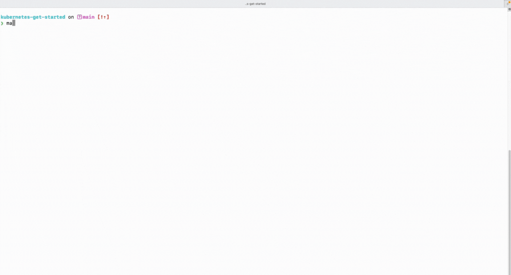

# kubernetes-get-started
Introduction to k8s

<image src="./doc/arch.png" width=1000 center>

[](https://hub.docker.com/r/grafana/grafana/tags)
[](https://hub.docker.com/r/grafana/grafana/tags)
[](https://hub.docker.com/r/grafana/grafana/tags)
[](https://hub.docker.com/_/mongo-express)


## 1. Overwiew
This project is a hand-on project to introduce someone to kubernetes (k8s) main concepts. The project draws a simple architecture where 2 pods (MongoDB and MongoExpress) are running inside a k8s cluster (Local Minikube cluster in this case). The pods are suported by 2 services one for external requests (MongoExpress service) and one for internal requests (MongoDB service). In addition, we'll configure secrets and ConfigMap files in order to define the credentials for the pods and make the blueprints more flexible to edit. 

<br/>

---
---
## 2. Prerequisites

For running this project locally, you need to have the following tools installed on your device:
- **Minikube**: which will be the (local) k8s cluster
- **Kubectl**: which will be used as a CLI to interact with the k8s cluster
- **Docker**: which will be the driver used for our minikube cluster
- **Git**: for the project's repository pulling

<br/>

---
---
## 3. Setting up the environment

After satisfying the above requirements, you can proceed with the following steps:

**Step 1**: Clone the project's repository

**Step 2**: Create a file named `mongo-secrets.yaml` in the root directory of the project. This file will be used to store the mongodb deployment credentials for connexion. 
```bash
$ touch mongo-secrets.yaml
```
Then, add the following content:

```yaml
apiVersion: apps/v1
kind: Secret
metadata:
  name: mongo-secret
type: Opaque #default type for key-value pairs
data:
  mongo-root-username: xxxxxx
  mongo-root-password: yyyyyy
```
Replace `xxxxxx` with your own credentials converted in base64. For example, if your `mongo-root-username` is `username`(in plain text) and your `mongo-root-password` is `password`(in plain text), `xxxxxx` and `yyyyy` will be the base64 encodings of `username` and `password` respectively:

```
$ echo -n "username" | base64
xxxxxx
$ echo -n "password" | base64
yyyyyy
```

**Step 3**: Start the minikube cluster by running the following command:
```bash
$ minikube start
```
From the `mongo-ingress.yaml` file, copy the hostname (`mongoui.tg`):

```yaml
apiVersion: networking.k8s.io/v1
kind: Ingress
...
spec:
  ingressClassName: "nginx"
  rules:
  - host: mongoui.tg  #the hostname where the ingress will be available
    ...

```
Get the Minikube ip address by running the following command

```bash
$ minikube ip
```
Then, add the Minikube ip address and the copied hostname to `/etc/hosts` by running the following command:

```bash
$ sudo sh -c "echo '$(minikube ip) mongoui.tg' >> /etc/hosts"
```
`[For MacOS users with Apple Silicon chip]` run the following command:
```bash
$ sudo sh -c "echo '127.0.0.1 mongoui.tg' >> /etc/hosts"
``` 


Then, setup all k8s components by running the following command:
```bash
$ make setup
```
`[For MacOS users with Apple Silicon chip]` Open a tunnel in order to allow the Ingress component to be accessible by running the following command:
```bash
$ minikube tunnel
```

</img>

`After doing whatever you want to do, you can delete all created components by running the following command:`

```bash
$ make destroy
```
<br/>

---
---
## 4. Troubleshooting
> To log in to MongoExpress UI, use the following credentials:
>
> - **Username**: `admin`
> - **Password**: `pass`
>
> Then, once you are logged in, you can create a new database and a > new collection or add a new admin.

> To understand and apply k8s Minikube ingress on MacOS and Linux, check the official k8s ingress documentation: [https://kubernetes.io/docs/tasks/access-application-cluster/ingress-minikube/](https://kubernetes.io/docs/tasks/access-application-cluster/ingress-minikube/) 

> To understand the overview of k8s ingress, check the official k8s ingress documentation: [https://kubernetes.io/docs/concepts/services-networking/ingress/](https://kubernetes.io/docs/concepts/services-networking/ingress/)


<br/>

<br />

## **CREDITS**

**AUTHOR :** ADOTRI Frimpong

